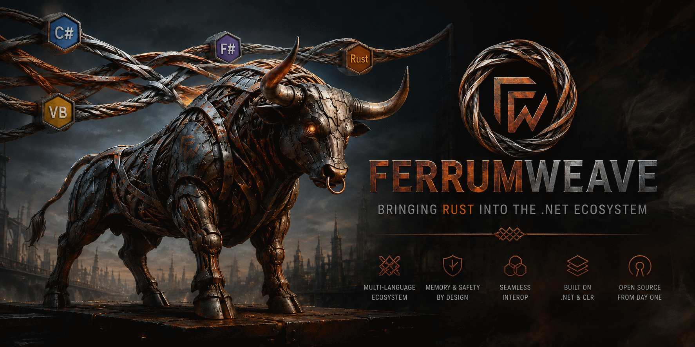

<!--
translation-of: README.md
locale: it
source-revision: 6fb75d076d59b4e1932b685e441487f6caedb36d
-->

[English](README.md) · [Deutsch](README.de.md) · [Español](README.es.md) · [Français](README.fr.md) · **Italiano** · [Português (Brasil)](README.pt-BR.md) · [Русский](README.ru.md) · [简体中文](README.zh-Hans.md) · [日本語](README.ja.md)

> La documentazione di FerrumWeave viene mantenuta in più lingue perché l’interoperabilità riguarda anche le persone. Il documento inglese senza suffisso resta la fonte canonica quando una traduzione è temporaneamente indietro.



# FerrumWeave

**Portare Rust nell’ecosistema dei linguaggi .NET.**

**Risorse del progetto:** [Struttura del repository](docs/architecture/repository-layout.md) · [Piano di release dei template](docs/roadmap/template-release-plan.md) · [Sito del progetto](https://chicodotnet.github.io/FerrumWeave/it/)

FerrumWeave è un progetto open source sperimentale che mira a rendere Rust un linguaggio di prima classe per la piattaforma .NET: compilare sorgenti Rust in assembly .NET, partecipare al Common Type System, consumare librerie .NET esistenti e interoperare in modo naturale con C#, F#, Visual Basic e altri linguaggi costruiti attorno al CLR.

Nel lungo periodo la developer experience dovrebbe risultare naturale:

```bash
dotnet new console -lang Rust -n HelloFerrum
cd HelloFerrum
dotnet run
```

Con codice Rust concettualmente simile a:

```rust
use dotnet::System::*;
use dotnet::Result;

fn main() -> Result<()> {
    Console::WriteLine("Hello from Rust on .NET")?;
    Ok(())
}
```

E producendo un vero assembly .NET:

```text
HelloFerrum.dll
```

eseguito dal runtime .NET.

> **FerrumWeave è all’inizio di questo percorso.**
>
> Gli esempi di questo README descrivono l’esperienza di sviluppo e la direzione architetturale desiderate. Non sono ancora dichiarazioni di funzionalità rilasciate.

---

## Perché FerrumWeave?

Una delle idee più durature di .NET non è mai stata C# in sé.

È stata l’idea che **linguaggi diversi potessero incontrarsi su un runtime comune**.

Per decenni gli sviluppatori hanno potuto scrivere software con linguaggi dalla sintassi, filosofia e storia molto diverse condividendo la stessa piattaforma:

- C#
- Visual Basic .NET
- F#
- C++/CLI
- JScript .NET
- J#
- IronPython
- IronRuby
- Nemerle
- Boo
- Oxygene
- e molti altri

Una libreria scritta in un linguaggio poteva spesso essere consumata da un altro perché il confine importante non era il linguaggio sorgente.

Era la **Common Language Infrastructure**, il **Common Type System**, i metadata degli assembly e il CLR.

FerrumWeave pone una domanda semplice:

> **E se Rust potesse entrare in questa famiglia di linguaggi?**

Non soltanto chiamando una libreria Rust nativa tramite FFI.

Non soltanto ospitando il CLR da un eseguibile Rust.

Non traducendo Rust in C#.

Ma compilando Rust nello stesso mondo di CIL, assembly, metadata, tipi, riferimenti, package, tooling e interoperabilità runtime che ha reso possibile il .NET multilinguaggio.

---

## Perché Rust?

Rust porta un diverso insieme di garanzie nello sviluppo software.

Il modello di ownership, il borrow checker, il forte sistema di tipi, la gestione esplicita degli errori e l’attenzione alla sicurezza della memoria e della concorrenza permettono di individuare intere categorie di difetti prima della produzione.

Rust **non** rende impossibile il fallimento del software.

La logica può essere sbagliata. I file possono sparire. Le reti possono fallire. I database possono contenere dati errati. I programmi possono andare in panic. Esiste codice `unsafe`.

Ma Rust può spostare importanti classi di problemi da:

```text
produzione
```

verso:

```text
tempo di compilazione
```

Questa differenza conta, soprattutto nei sistemi aziendali di lunga durata.

---

## L’opportunità nel software aziendale

Esistono enormi sistemi .NET che producono valore da dieci, quindici o venticinque anni.

Possono contenere:

```text
ERP.vbproj
Accounting.csproj
Reporting.fsproj
LegacyIntegration.vbproj
```

Troppo spesso la modernizzazione comincia con:

> “Dovremmo riscriverlo.”

FerrumWeave parte da un’altra idea:

> **Conserva ciò che funziona. Rafforza ciò che viene dopo.**

Immagina di aggiungere:

```text
RiskEngine.rsproj
```

allo stesso sistema.

L’applicazione Visual Basic esistente non deve scomparire. Il domain model C# non deve essere riscritto. Il motore di reporting F# non ha bisogno di un nuovo protocollo di integrazione.

In futuro:

```text
ERP.vbproj
     │
     ▼
RiskEngine.rsproj
     │
     ▼
Accounting.csproj
```

potrebbero comunicare attraverso lo stesso sistema di tipi .NET.

Un’applicazione Visual Basic vecchia di decenni potrebbe chiamare nuovo codice Rust. Rust potrebbe consumare un assembly di dominio scritto in C#. F# potrebbe consumare un tipo implementato in Rust.

L’unità di migrazione diventa **il componente**, non l’intera applicazione.

Questa è la visione.

---

# L’obiettivo

FerrumWeave mira a rendere possibile:

```text
                    .NET
                     │
             Common Type System
                     │
       ┌─────────────┼─────────────┐
       │             │             │
      C#            F#           Rust
       │             │             │
    Roslyn          fsc          rustc
       │             │             │
       └─────────────┼─────────────┘
                     │
                     ▼
                CIL + Metadata
                     │
                     ▼
                    CLR
```

Il percorso di compilazione previsto per Rust è circa:

```text
Rust source
    │
    ▼
rustc frontend
    │
    ▼
HIR / MIR
    │
    ▼
CLR code generation
    │
    ▼
CIL + .NET metadata
    │
    ▼
.NET assembly
    │
    ▼
CLR
```

Rust resta Rust.

Il CLR resta il CLR.

FerrumWeave deve collegarli, non reinventarli senza necessità.

---

# Cosa FerrumWeave non è

FerrumWeave **non** vuole essere:

### Un nuovo linguaggio simile a Rust

L’obiettivo è preservare Rust e beneficiare dell’ecosistema del compilatore esistente.

```rust
match
traits
lifetimes
ownership
borrowing
async
Result<T, E>
```

devono restare concetti Rust, non approssimazioni ricreate in un altro compilatore.

### Un wrapper Rust attorno a `dotnet`

Eseguire Cargo da un target MSBuild può essere utile, ma da solo non rende Rust un linguaggio .NET.

FerrumWeave punta più in profondità.

### Un generatore FFI nativo

L’interoperabilità nativa resta importante, ma l’obiettivo non è:

```text
C#
 ↓
P/Invoke
 ↓
Rust native DLL
```

L’obiettivo è:

```text
C#
  ╲
   CLR
  ╱
Rust
```

### Un sostituto di .NET

FerrumWeave esiste perché l’ecosistema .NET ha valore. L’obiettivo è ampliare le opzioni linguistiche disponibili.

### Un sostituto di Rust nativo

Ci saranno sempre ottime ragioni per compilare Rust direttamente in codice nativo. Un target CLR sarebbe un’ulteriore opzione di deployment e interoperabilità.

---

# La developer experience desiderata

Un progetto Rust dovrebbe in futuro sentirsi a casa dentro una soluzione .NET:

```text
EnterpriseSystem.slnx
│
├── Domain/
│   └── Domain.csproj
├── Reporting/
│   └── Reporting.fsproj
├── Legacy/
│   └── Legacy.vbproj
└── RiskEngine/
    └── RiskEngine.rsproj
```

I comandi familiari devono restare familiari:

```bash
dotnet restore
dotnet build
dotnet run
dotnet test
dotnet publish
dotnet pack
```

Un progetto potrebbe assomigliare a:

```xml
<Project Sdk="FerrumWeave.Sdk">
  <PropertyGroup>
    <TargetFramework>net10.0</TargetFramework>
    <RustEdition>2024</RustEdition>
  </PropertyGroup>
  <ItemGroup>
    <ProjectReference Include="../Domain/Domain.csproj" />
    <PackageReference Include="Some.DotNet.Package" Version="..." />
  </ItemGroup>
</Project>
```

Cargo e crates.io devono conservare il loro ruolo quando le dipendenze Rust lo richiedono. NuGet e MSBuild devono continuare a fare bene ciò che già fanno per le dipendenze .NET.

FerrumWeave deve connettere questi ecosistemi senza fingere che uno dei due non esista.

---

# Librerie .NET da Rust

Un obiettivo centrale è rendere le API .NET partecipanti naturali del codice Rust.

```rust
use dotnet::System::*;
use dotnet::System::IO::*;

fn main() -> Result<()> {
    Console::Write("Name: ")?;
    let name = Console::ReadLine()?;
    File::WriteAllText("name.txt", &name)?;
    Ok(())
}
```

La proprietà importante non è la sintassi esatta, ma questa:

> `System.Console`, `System.String`, `System.IO.File` e i tipi .NET definiti dall’utente devono essere compresi come tipi e membri CLR, non come librerie native opache nascoste dietro uno strato FFI mantenuto manualmente.

Lo stesso principio dovrebbe applicarsi ai package NuGet e ai ProjectReference.

---

# Librerie Rust da altri linguaggi .NET

L’interoperabilità deve funzionare in entrambe le direzioni.

Rust deve poter definire tipi pubblici orientati al CLR consumabili dagli altri linguaggi .NET.

Rust:

```rust
pub struct RiskEngine {
    // ...
}

impl RiskEngine {
    pub fn calculate(&self, customer: Customer) -> RiskScore {
        // ...
    }
}
```

C#:

```csharp
var engine = new RiskEngine();
var score = engine.Calculate(customer);
```

Visual Basic:

```vb
Dim engine = New RiskEngine()
Dim score = engine.Calculate(customer)
```

F#:

```fsharp
let engine = RiskEngine()
let score = engine.Calculate(customer)
```

Linguaggi sorgente diversi. Un unico contratto runtime.

Questo è lo standard di interoperabilità a cui FerrumWeave aspira.

---

# Tipi Rust e tipi CLR

Rust e il CLR hanno modelli di oggetti e memoria fondamentalmente diversi. Questa differenza non deve essere nascosta.

Rust possiede concetti come:

```text
ownership
borrowing
lifetimes
RAII
Box<T>
Vec<T>
String
Option<T>
Result<T, E>
```

Il CLR possiede:

```text
managed references
garbage collection
System.Object
System.String
arrays
interfaces
delegates
exceptions
Task<T>
```

FerrumWeave non deve indebolire nessuno dei due modelli solo per farli sembrare uguali. Deve invece definire mapping basati su principi chiari.

Alcuni sono naturali:

```text
System.Int32   ↔ i32
System.Int64   ↔ i64
System.Boolean ↔ bool
System.Double  ↔ f64
```

Altri richiedono semantica esplicita:

```text
System.String
managed classes
interfaces
delegates
exceptions
Task<T>
Span<T>
Nullable<T>
```

Definire correttamente queste semantiche è una delle sfide ingegneristiche centrali del progetto.

---

# Sicurezza senza abbandonare l’interoperabilità

Il software aziendale raramente può permettersi di ripartire da zero.

Le organizzazioni hanno applicazioni, database, regole di business, API, package, framework, sviluppatori e conoscenza operativa già esistenti.

Un linguaggio più sicuro è molto più facile da adottare se non richiede di abbandonare tutto il resto.

FerrumWeave esplora quindi questa proposta:

> **Portare il modello di sicurezza di Rust nei nuovi componenti .NET critici preservando l’interoperabilità con gli investimenti .NET esistenti.**

---

# Perché il nome FerrumWeave?

**Ferrum** significa ferro in latino. Rust è l’ossidazione del ferro.

**Weave** significa intrecciare fili separati in una struttura connessa.

```text
Ferrum
   │
   └── iron → rust

Weave
   │
   └── interconnection → network → ecosystem
```

Insieme:

> **FerrumWeave rappresenta Rust intrecciato nell’ecosistema .NET.**

Il nome è volutamente indipendente dai marchi Rust e .NET.

---

# Costruire sul lavoro esistente

FerrumWeave non vuole iniziare scrivendo un altro compilatore Rust.

L’ecosistema Rust offre già infrastrutture di enorme valore:

- `rustc` per parsing, type checking, borrow checking, MIR e semantica del linguaggio;
- `rust-analyzer` per l’analisi moderna del codice Rust e il tooling di sviluppo.

Esiste inoltre prior art importante per Rust verso CLR, in particolare il progetto sperimentale `rustc_codegen_clr`.

.NET offre già infrastrutture mature per CLR, CTS, metadata degli assembly, MSBuild, NuGet, CLI `dotnet`, progetti SDK-style, debugging e tooling.

La strategia di FerrumWeave è quindi:

> **Integrare prima di reinventare.**

Quando possibile, i miglioramenti dovrebbero essere contribuiti upstream anziché mantenuti per sempre in fork privati.

---

# Architettura iniziale

```text
FerrumWeave
│
├── CLR code generation
│   └── Rust MIR → CIL / metadata
├── CLR projection
│   └── .NET metadata → Rust-visible types and members
├── SDK
│   └── .rsproj / MSBuild / dotnet CLI integration
├── interoperability
│   └── Rust ↔ CTS semantics
├── code analysis
│   └── rust-analyzer awareness of CLR symbols
├── debugging
│   └── source mapping / PDB / stepping / locals
└── tooling
    └── templates, testing, publishing and packaging
```

La struttura prevista del repository è documentata in [Repository layout](docs/architecture/repository-layout.md).

L’architettura è volutamente provvisoria. L’evidenza eseguibile ha priorità sui diagrammi.

---

# Prima prova

Il primo milestone significativo è intenzionalmente piccolo:

```bash
dotnet new console -lang Rust -n HelloFerrum
cd HelloFerrum
dotnet run
```

```rust
use dotnet::System::*;

fn main() -> Result<()> {
    Console::WriteLine("Hello from FerrumWeave")?;
    Ok(())
}
```

FerrumWeave deve produrre un assembly .NET valido ed eseguire `System.Console.WriteLine` attraverso il CLR.

Questo singolo risultato validerebbe insieme `.rsproj`, MSBuild, `dotnet` CLI, `rustc`, Rust→CIL, metadata CLR, interop CTS e .NET BCL.

Il progetto crescerà verticalmente a partire da contratti funzionanti, invece di provare a modellare tutto .NET prima che qualcosa venga eseguito.

---

# Successo a lungo termine

FerrumWeave non sarà considerato riuscito soltanto perché Rust può emettere “un po’ di CIL”.

La domanda più profonda è:

> **Uno sviluppatore .NET può trattare Rust come un’altra scelta di linguaggio seria dentro un sistema .NET esistente?**

Un FerrumWeave maturo dovrebbe rendere normali scenari come:

```text
C# → Rust
Rust → C#
VB → Rust
Rust → F#
Rust → NuGet package
.NET project → .rsproj
.rsproj → .NET project
```

con le aspettative usuali su build, references, package, tipi, eccezioni, debugging, testing, tooling e publishing.

---

# Principi del progetto

### Preservare Rust

Evitare un dialetto Rust non necessario.

### Preservare .NET

Usare CLR, CTS, metadata, MSBuild, NuGet e i contratti esistenti della piattaforma.

### Interoperare in modo incrementale

Un’applicazione di vent’anni non dovrebbe richiedere una riscrittura per beneficiare di un nuovo componente Rust.

### Preferire Safe Rust

`unsafe` è legittimo, ma il progetto deve massimizzare l’area in cui le normali garanzie di sicurezza di Rust restano significative.

### Rendere espliciti i confini

Ownership Rust e garbage collection CLR sono sistemi differenti. I confini semantici difficili devono essere modellati deliberatamente.

### Contribuire upstream quando pratico

Un ecosistema sostenibile è preferibile a fork permanenti.

### Evidenza prima delle affermazioni

La correttezza del compilatore deve derivare da test eseguibili, validazione differenziale, conformità e applicazioni reali, non da diagrammi ottimistici.

### La compatibilità è un contratto

Ogni comportamento .NET dichiarato deve essere protetto da test ripetibili.

---

# Open source dall’inizio

FerrumWeave è sviluppato apertamente ed è disponibile, a scelta, sotto:

- [MIT License](LICENSE-MIT); oppure
- [Apache License, Version 2.0](LICENSE-APACHE).

Usare il compilatore non deve imporre la licenza FerrumWeave al programma compilato.

---

# Visione di governance

FerrumWeave nasce come progetto indipendente.

Se diventerà abbastanza utile da sviluppare un vero ecosistema multi-azienda e multi-comunità, la governance dovrà poter diventare indipendente dal creatore originale.

Una sede neutrale a lungo termine presso una fondazione open source appropriata sarebbe un successo, non una perdita di proprietà.

Il progetto deve quindi favorire decisioni tecniche trasparenti, provenienza IP pulita, tracciabilità dei contributori, asset trasferibili e governance aperta.

Al momento non esiste alcuna affiliazione con una fondazione.

---

# Relazione con Rust e .NET

FerrumWeave è un progetto sperimentale indipendente.

Non è attualmente affiliato, sponsorizzato o approvato da Microsoft, .NET Foundation, Rust Foundation o Rust Project.

“Rust” e “.NET” vengono usati per descrivere accuratamente le tecnologie con cui FerrumWeave intende interoperare.

---

# Stato

**Pre-alpha / esplorazione architetturale.**

Il repository parte intenzionalmente dal problema, dai principi, dai contratti target e dai confini ingegneristici prima di dichiarare un’implementazione completa del linguaggio.

Il primo obiettivo è un vertical slice affidabile:

```text
Rust source
    ↓
.rsproj
    ↓
dotnet build / dotnet run
    ↓
CIL
    ↓
CLR
    ↓
System.Console.WriteLine
```

Da lì, un contratto alla volta.

---

# L’idea in una frase

> **FerrumWeave mira a rendere Rust un linguaggio .NET di prima classe affinché le organizzazioni possano introdurre il modello di sicurezza di Rust nei nuovi componenti critici senza abbandonare software, librerie, linguaggi e conoscenza operativa già esistenti.**

---

## Un Hello World molto vecchio. Un compilatore molto moderno.

Un’applicazione Visual Basic scritta decenni fa dovrebbe un giorno poter chiamare codice Safe Rust scritto oggi.

Non attraverso un confine di servizi.

Non tramite una riscrittura.

Non perché un linguaggio finga di essere l’altro.

Perché entrambi possono parlare il linguaggio che il CLR è stato progettato per fornire tra linguaggi diversi.

Questo è l’intreccio.